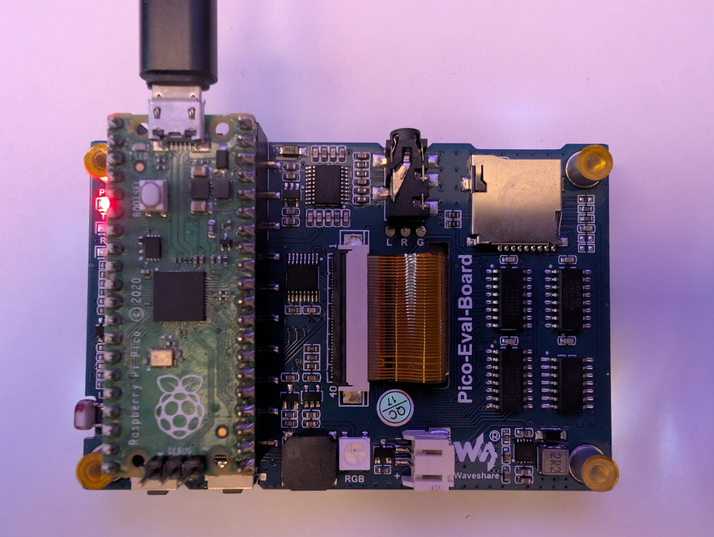

# PicoDeck ED Display

PicoDeck ED Display is standalone RP2040 firmware that shows live Elite
Dangerous telemetry on a Waveshare Pico-Eval-Board. It is a display application,
not a game controller and not a USB keyboard.

The Pico presents itself to Windows as a CDC-NCM USB network adapter, obtains
data directly from the EDDiscovery `EDDJSON` WebSocket server, and renders the
data on the Eval Board's 3.5-inch display. No Wi-Fi, Ethernet controller, serial
telemetry protocol, or companion PC application is used.

> **EDDiscovery is mandatory.** Without a running EDDiscovery Web Server this
> firmware has no Elite Dangerous telemetry source.

|  |  |
|---|---:|

## Supported hardware

- classic Raspberry Pi Pico with RP2040
- [Waveshare Pico-Eval-Board](https://www.waveshare.com/wiki/Pico-Eval-Board)
- integrated 3.5-inch 480x320 ILI9488 SPI display
- integrated XPT2046 resistive-touch controller
- USB data cable connected to the Pico's native micro-USB connector

This target was not built for Pico W, Pico 2, or Pico 2 W.

The Eval Board also has a second micro-USB connector connected to its CP2102
USB-to-UART bridge. That port can provide power and UART access, but it cannot
carry the firmware's CDC-NCM network interface. Use the connector physically on
the Pico.

## Display pages

- **Route**: final destination, jumps remaining, current system, next system,
  shields, mass lock, low fuel, and danger
- **Ship**: ship name, fuel, tank size, jump range, cargo, flight mode, legal
  state, pips, overheat, and interdiction
- **System**: current system, body, station, allegiance, economy, security, and
  distance from Sol
- **Info**: commander, game mode, flight state, credits, distance from Sol, and
  current system

Long system, station, body, destination, and ship names are clipped to fixed
regions and scroll automatically. Touch anywhere on the display to advance one
page. The Eval Board's physical `KEY1` performs the same action. Both inputs are
debounced and holding an input does not repeat.

## Route-state behavior

The firmware combines several EDDiscovery sources because they have different
meanings and update timing:

- `Journal.NavRoute` supplies the full plotted route and final destination.
- subsequent `Journal.FSDJump` rows are counted to recover current progress.
- `genericui/FSDTarget.StarSystem` supplies the current next system.
- `RemainingJumpsInRoute` supplies live remaining-jump progress.
- a transient `FSDJumpNextSystemName: null` is ignored because it means that a
  jump transition is not currently active, not that the route was cleared.

Recent journal rows are requested every ten seconds as recovery from a missed
push message or Pico restart. Timestamp and monotonic-progress rules prevent an
old route snapshot from restoring an obsolete jump count.

## USB network

TinyUSB exposes one CDC-NCM network function and uses a Microsoft OS descriptor
so current Windows versions automatically bind the WINNCM driver. lwIP and a
small DHCP server run on the Pico.

| Endpoint | Address |
|---|---:|
| Pico | `192.168.7.1/24` |
| Windows | `192.168.7.2/24` |
| EDDiscovery | `192.168.7.2:6502` |
| Default gateway | none |
| DNS | none |

The Pico initiates a TCP connection to Windows and upgrades it to an `EDDJSON`
WebSocket. It sends masked RFC 6455 frames, handles ping/pong and fragmented text
messages, reconnects automatically, and retains the last display data during a
temporary EDDiscovery reconnect.

Do not configure a gateway, DNS server, network bridge, or Internet Connection
Sharing on this adapter.

## EDDiscovery configuration

1. Install and start [EDDiscovery](https://github.com/EDDiscovery/EDDiscovery).
2. Enable the EDDiscovery **Web Server**.
3. Configure port `6502`.
4. Allow `EDDiscovery.exe` through Windows Firewall for the Pico USB network.
5. Connect the Pico's native USB cable.

At boot the LCD flashes orange and then shows diagnostics. Expected progression
is `USB OFFLINE`, `CONNECTING`, `HANDSHAKE`, and `CONNECTED`. After initial
connection the normal pages appear. If EDDiscovery later disconnects, the page
remains visible and the top-right status changes from `ONLINE` to `RECONNECT`.
The full diagnostics page returns only when the USB network itself is lost.

If the device stays at `RETRYING`, verify that Windows owns `192.168.7.2`, that
EDDiscovery is listening on TCP `6502`, and that Windows Firewall is not
blocking the new adapter profile.

## Flash a prebuilt UF2

The project build writes:

```text
dist\PicoDeck-ED-Display.uf2
dist\LICENSE
dist\THIRD_PARTY_NOTICES.md
```

To install it:

1. Disconnect the Pico's native USB cable.
2. Hold the Pico's **BOOTSEL** button.
3. Reconnect the native USB cable while holding BOOTSEL.
4. Release BOOTSEL when Windows shows the `RPI-RP2` drive.
5. Copy `PicoDeck-ED-Display.uf2` onto that drive.
6. The drive unmounts and the Pico reboots automatically.
7. Wait for Windows to create the `PicoDeck ED Display` network adapter.

## Build from a clean Windows checkout

The provided scripts install and use a private portable toolchain. They do not
modify the system `PATH` permanently and do not require Visual Studio, VS Code,
Arduino IDE, or Thonny.

### Requirements

- 64-bit Windows 10 or Windows 11
- PowerShell 5.1 or later
- `curl.exe` and `tar.exe` available in `PATH`
- Internet access during first-time setup
- approximately 1 GB of free disk space

### 1. Install the pinned toolchain

From this directory, double-click:

```text
setup-toolchain.cmd
```

Or run:

```powershell
cd C:\path\to\PicoDeck-EDDiscovery\PicoDeck-ED-Display
powershell.exe -NoProfile -ExecutionPolicy Bypass -File .\tools\setup-toolchain.ps1
```

The project wrapper invokes the repository's shared installer. It downloads and
hash-verifies Pico SDK 2.2.0, TinyUSB at commit `86ad6e56`, lwIP at commit
`77dcd25a`, Arm GNU Toolchain 14.3.Rel1, CMake 3.28.6, Ninja 1.12.1,
Raspberry Pi SDK tools 2.2.0-3, picotool 2.2.0-a4, and Python 3.12.10.

The resulting `.toolchain` and `.downloads` directories are ignored by Git. The
same installation can be reused for later builds.

### 2. Build Release firmware

Double-click:

```text
build.cmd
```

Or run:

```powershell
powershell.exe -NoProfile -ExecutionPolicy Bypass -File .\tools\build.ps1 -Configuration Release
```

CMake configures an RP2040 target with `PICO_BOARD=pico`, Ninja compiles it, and
the script copies the UF2 and release license files to:

```text
dist\PicoDeck-ED-Display.uf2
dist\LICENSE
dist\THIRD_PARTY_NOTICES.md
```

Intermediate files are placed in `build-rp2040`. For a completely clean rebuild,
delete `build-rp2040` and run the build again. To compile an unoptimized debug
image, replace `Release` with `Debug`.

The wrapper records the absolute shared-toolchain location in the build tree.
If the repository is moved or a toolchain is installed in a different
directory, the wrapper detects the mismatch and removes the stale
`build-rp2040` cache automatically. Builds using the same toolchain remain
incremental.

### Reproduce the underlying CMake invocation

`tools/build.ps1` sets `PICO_SDK_PATH` and `PICO_TOOLCHAIN_PATH`, then performs
the equivalent of:

```powershell
cmake -S . -B build-rp2040 -G Ninja `
  -DCMAKE_BUILD_TYPE=Release `
  -DPICO_BOARD=pico `
  -DPICO_SDK_PATH=<shared-toolchain>\sdk\pico-sdk-2.2.0 `
  -DPICO_TOOLCHAIN_PATH=<shared-toolchain>\gcc
cmake --build build-rp2040
```

Using `build.cmd` is recommended because it also supplies pinned CMake, Ninja,
Python, pioasm, and picotool paths.

## Development environment

This firmware was developed and release-built on:

- Windows 11 Pro 25H2 x64, build `26200.8655`
- Windows PowerShell `5.1.26100.8655`
- Raspberry Pi Pico RP2040
- Waveshare Pico-Eval-Board
- Pico SDK 2.2.0
- Arm GNU Toolchain 14.3.Rel1 / GCC 14.3.1
- CMake 3.28.6, Ninja 1.12.1, Python 3.12.10
- TinyUSB commit `86ad6e56c1700e85f1c5678607a762cfe3aa2f47`
- lwIP commit `77dcd25a72509eb83f72b033d219b1d40cd8eb95`
- picotool 2.2.0-a4
- EDDiscovery and Elite Dangerous running on the same PC

## Source layout

```text
src/main.c               initialization and main event loop
src/dashboard.c          page rendering, scrolling text, and connection UI
src/edd_state.c          EDDJSON parsing and route-state reconciliation
src/usb_descriptors.c    Windows CDC-NCM USB descriptors
src/lcd.c                ILI9488 driver and backlight control
src/board.h              pinout, network addresses, and hardware constants
third_party/jsmn/        vendored JSON parser
tools/                   setup and build entry points
../common/net_usb.c      shared lwIP netif and DHCP server integration
../common/websocket_client.c  shared RFC 6455 transport and reconnect logic
../common/eddjson_client.c    shared EDDJSON requests and refresh scheduling
../common/lwipopts.h          shared no-OS lwIP configuration
```

Display configures the common modules for `192.168.7.0/24`, a 32 KiB WebSocket
receive buffer, status/indicator/journal startup requests, and a periodic recent
journal request. Its telemetry parser and NCM-only USB descriptors remain local
to this target.

## Third-party code and license

- original PicoDeck firmware and documentation: [MIT](../LICENSE)
- jsmn: MIT; see `third_party/jsmn/LICENSE`
- TinyUSB: MIT
- Raspberry Pi Pico SDK and lwIP: their respective BSD-style licenses

The MIT grant does not relicense third-party components. Copyright notices,
exact license scope, and upstream license locations are collected in
[THIRD_PARTY_NOTICES.md](../THIRD_PARTY_NOTICES.md).
