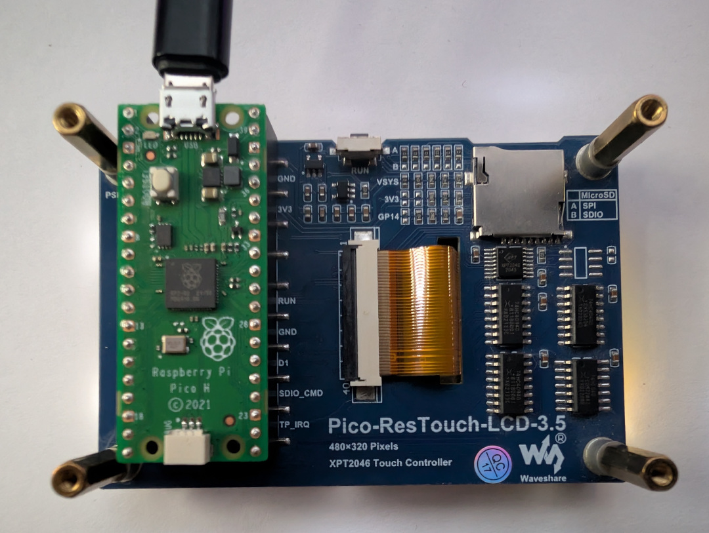

# PicoDeck ED Keyboard

PicoDeck ED Keyboard is a 6x4 touchscreen button box for Elite Dangerous. It
runs directly on a classic Raspberry Pi Pico and Waveshare
Pico-ResTouch-LCD-3.5. One native USB cable exposes both a standard HID keyboard
and a CDC-NCM network adapter.

The HID function sends the configured game keys. The network function connects
directly to EDDiscovery and keeps telemetry-backed buttons highlighted while
their corresponding ship state or game panel is active. No companion keyboard
application, serial protocol, Wi-Fi, or Ethernet controller is used.

> **EDDiscovery is required for complete operation.** Raw HID key presses still
> work if EDDiscovery is unavailable, but persistent landing gear, lights,
> hardpoints, cargo scoop, mode, and panel state cannot be displayed.

|  |  |
|---|---:|

## Supported hardware

- classic Raspberry Pi Pico with RP2040
- [Waveshare Pico-ResTouch-LCD-3.5](https://www.waveshare.com/wiki/Pico-ResTouch-LCD-3.5)
- 3.5-inch 480x320 ILI9488 SPI display
- XPT2046 resistive-touch controller
- USB data cable connected to the Pico's native micro-USB connector

This target was not built for Pico W, Pico 2, or Pico 2 W.

Install the Pico in the direction marked by Waveshare: the Pico USB connector
must face the same direction as the display board's microSD slot. The firmware
rotates the image and touch axes by 180 degrees so the assembled unit can stand
with its USB cable at the top.

## USB device behavior

The firmware is a composite USB device with VID/PID `CAFE:4024`:

- HID boot-keyboard interface for Elite Dangerous controls
- CDC-NCM/WINNCM network interface for EDDiscovery state

Windows installs both functions from the same cable. Changing the USB PID from
the earlier keyboard-only firmware is intentional because Windows caches the
interface layout associated with a VID/PID.

## Button layout and default HID map

| Row | Button | HID key |
|---:|---|---|
| 1 | Landing gear | `L` |
| 1 | Speed 0% | `X` |
| 1 | FSD jump | `J` |
| 1 | Ship lights | `Insert` |
| 1 | Silent running | `Delete` |
| 1 | Night vision | `]` |
| 2 | Hardpoints | `U` |
| 2 | Next fire group | `N` |
| 2 | Target | `T` |
| 2 | Next target | `G` |
| 2 | Analysis/combat mode | `M` |
| 2 | FSS scan | `'` |
| 3 | Shield power | `Left Arrow` |
| 3 | Engine power | `Up Arrow` |
| 3 | Weapon power | `Right Arrow` |
| 3 | Balance power | `Down Arrow` |
| 3 | Cargo scoop | `Home` |
| 3 | Eject cargo | `/` |
| 4 | Target panel | `1` |
| 4 | Comms panel | `2` |
| 4 | Role panel | `3` |
| 4 | System panel | `4` |
| 4 | Galaxy map | `,` |
| 4 | System map | `.` |

Every accepted touch immediately turns the tile white and sends one 60 ms HID
keypress without auto-repeat. Once the finger is released, a telemetry-backed
tile returns to orange or remains white according to the latest EDDiscovery
state.

Hold the bottom-right **SYSTEM MAP** tile for six seconds to reboot directly
into BOOTSEL mode.

## Persistent EDDiscovery states

The following tiles can remain white after release:

- landing gear
- FSD charging, FSD jump, or supercruise
- ship lights
- silent running
- night vision
- hardpoints
- HUD analysis mode
- FSS mode
- cargo scoop
- target, comms, role, and system panels
- galaxy map and system map

The firmware reads `indicator`, `indicatorpush`, and `GUIFocus` data. Actions
without an unambiguous binary state remain momentary. This includes speed 0%,
fire group, target selection, power-distribution commands, and cargo eject. The
firmware does not invent a state for those buttons.

## USB network

TinyUSB exposes CDC-NCM and uses a Microsoft OS descriptor so current Windows
versions bind WINNCM automatically. lwIP and a DHCP server run on the Pico.

| Endpoint | Address |
|---|---:|
| Pico | `192.168.8.1/24` |
| Windows | `192.168.8.2/24` |
| EDDiscovery | `192.168.8.2:6502` |
| Default gateway | none |
| DNS | none |

The Pico initiates the TCP/WebSocket connection. It requests an indicator
snapshot at connection time and every ten seconds as recovery, consumes push
updates, handles WebSocket fragmentation and ping/pong, and reconnects
automatically.

Do not add a gateway or DNS server and do not enable network bridging or
Internet Connection Sharing on the keyboard adapter.

## EDDiscovery configuration

1. Install and start [EDDiscovery](https://github.com/EDDiscovery/EDDiscovery).
2. Enable the EDDiscovery **Web Server**.
3. Set the port to `6502`.
4. Allow `EDDiscovery.exe` through Windows Firewall for the Pico USB network.
5. Connect the keyboard Pico with a USB data cable.

The startup diagnostics screen shows:

- HID keyboard readiness
- Pico USB-network readiness and `192.168.8.1`
- expected Windows address `192.168.8.2`
- EDDiscovery connection state

After HID and EDDiscovery are connected, diagnostics remain for 0.8 seconds and
then the normal grid appears. If EDDiscovery is unavailable, the grid still
appears after a maximum of 15 seconds so HID controls remain usable. Later
WebSocket reconnects occur silently behind the button grid.

If state highlighting does not work, confirm that Windows owns `192.168.8.2`,
that EDDiscovery listens on TCP `6502`, and that the firewall allows the new
WINNCM network profile.

## Flash a prebuilt UF2

The project build writes:

```text
dist\PicoDeck-ED-Keyboard.uf2
dist\LICENSE
dist\THIRD_PARTY_NOTICES.md
dist\ICON_UPSTREAM_LICENSE.md
```

To install it:

1. Disconnect the Pico's native USB cable.
2. Hold the Pico's white **BOOTSEL** button.
3. Reconnect USB while holding BOOTSEL.
4. Release BOOTSEL when Windows shows the `RPI-RP2` drive.
5. Copy `PicoDeck-ED-Keyboard.uf2` onto that drive.
6. The Pico reboots automatically.
7. Wait for Windows to install both `PicoDeck ED Keyboard` functions.

If Windows retained the previous keyboard-only USB layout, remove the old
PicoDeck device in Device Manager, disconnect the Pico, and reconnect it.

## Build from a clean Windows checkout

The supplied scripts use a private portable toolchain and do not permanently
modify the Windows `PATH`. Visual Studio, VS Code, Arduino IDE, and Thonny are
not required.

### Requirements

- 64-bit Windows 10 or Windows 11
- PowerShell 5.1 or later
- `curl.exe` and `tar.exe` in `PATH`
- Internet access for first-time setup
- approximately 1 GB of free disk space

### 1. Install the pinned toolchain

From this directory, double-click:

```text
setup-toolchain.cmd
```

Or run:

```powershell
cd C:\path\to\PicoDeck-EDDiscovery\PicoDeck-ED-Keyboard
powershell.exe -NoProfile -ExecutionPolicy Bypass -File .\tools\setup-toolchain.ps1
```

The wrapper invokes the repository's shared installer. It downloads and
SHA-256-verifies Pico SDK 2.2.0, TinyUSB commit `86ad6e56`, lwIP commit
`77dcd25a`, Arm GNU Toolchain 14.3.Rel1, CMake 3.28.6, Ninja 1.12.1,
Raspberry Pi SDK tools 2.2.0-3, picotool 2.2.0-a4, and Python 3.12.10.

The ignored `.toolchain` and `.downloads` directories can be reused for every
later build.

### 2. Build Release firmware

Double-click:

```text
build.cmd
```

Or run:

```powershell
powershell.exe -NoProfile -ExecutionPolicy Bypass -File .\tools\build.ps1 -Configuration Release
```

CMake configures `PICO_BOARD=pico`, Ninja compiles the firmware, and the script
copies the result and release license files to:

```text
dist\PicoDeck-ED-Keyboard.uf2
dist\LICENSE
dist\THIRD_PARTY_NOTICES.md
dist\ICON_UPSTREAM_LICENSE.md
```

Intermediate files are stored in `build-rp2040`. Delete that directory before
building when a completely clean configure is required. Use
`-Configuration Debug` for an unoptimized debug image.

The wrapper records the absolute shared-toolchain location in the build tree.
If the repository is moved or a toolchain is installed in a different
directory, the wrapper detects the mismatch and removes the stale
`build-rp2040` cache automatically. Builds using the same toolchain remain
incremental.

### Reproduce the underlying CMake invocation

`tools/build.ps1` supplies every pinned executable path and performs the
equivalent of:

```powershell
cmake -S . -B build-rp2040 -G Ninja `
  -DCMAKE_BUILD_TYPE=Release `
  -DPICO_BOARD=pico `
  -DPICO_SDK_PATH=<shared-toolchain>\sdk\pico-sdk-2.2.0 `
  -DPICO_TOOLCHAIN_PATH=<shared-toolchain>\gcc
cmake --build build-rp2040
```

The project script is recommended because it also selects the pinned Ninja,
Python, pioasm, and picotool binaries and copies the final UF2.

## Development environment

This firmware was developed and release-built on:

- Windows 11 Pro 25H2 x64, build `26200.8655`
- Windows PowerShell `5.1.26100.8655`
- Raspberry Pi Pico RP2040
- Waveshare Pico-ResTouch-LCD-3.5
- Pico SDK 2.2.0
- Arm GNU Toolchain 14.3.Rel1 / GCC 14.3.1
- CMake 3.28.6, Ninja 1.12.1, Python 3.12.10
- TinyUSB commit `86ad6e56c1700e85f1c5678607a762cfe3aa2f47`
- lwIP commit `77dcd25a72509eb83f72b033d219b1d40cd8eb95`
- picotool 2.2.0-a4
- EDDiscovery and Elite Dangerous running on the same PC

## Touch calibration

The default Q16.16 calibration coefficients are in `src/board.h`. `src/touch.c`
samples each point twice and rejects inconsistent readings. The complete touch
coordinate system is inverted to match the cable-at-top display rotation.

Test the four corners and all edge tiles after flashing. A consistent offset or
mirror indicates calibration/orientation and should be corrected in
`src/board.h` or `src/touch.c`. Random misses normally indicate insufficient or
uneven pressure on the resistive panel. Remove the protective transport film
before calibrating.

## Customizing buttons

- labels, HID usages, and icon selection: `src/buttons.c`
- EDDiscovery-to-button state mapping: `src/edd_buttons.c`
- generated icon masks: `assets/icons.c`
- display and touch pinout/calibration: `src/board.h`
- tile rendering: `src/ui.c`

After changing HID usages, verify the binding inside Elite Dangerous. The
firmware sends HID usage codes, not Windows virtual-key names.

## Source layout

```text
src/main.c               USB/network/touch event loop and HID reports
src/ui.c                 6x4 tile renderer and startup diagnostics
src/buttons.c            labels, icons, and HID usages
src/edd_buttons.c        persistent telemetry-state mapping
src/websocket_client.c   TCP/WebSocket client and reconnect logic
src/net_usb.c            lwIP netif and DHCP server
src/usb_descriptors.c    composite HID + Windows CDC-NCM descriptors
src/touch.c              XPT2046 sampling and coordinate filtering
src/lcd.c                ILI9488 driver
assets/                  generated icon masks and upstream license material
tools/                   setup and build entry points
```

## Icons and licensing

Original PicoDeck firmware source and documentation are licensed under the
repository-level [MIT License](../LICENSE). This MIT grant does not cover the
third-party icon artwork.

The icon masks come from the Sidewinder Orange theme in
[`streamdeck-elite-icons`](https://github.com/Ordo-Corona-Stellarum/streamdeck-elite-icons)
at commit `d2f58e41d86374dfc67efe15098d06f021d4cb79`. The artwork is Copyright
2020 Keath Milligan and licensed under CC BY-SA 3.0. The generated masks in
`assets/icons.c` and the copies embedded in the Keyboard UF2 remain under that
license. See [assets/UPSTREAM_LICENSE.md](assets/UPSTREAM_LICENSE.md) and the
repository's [THIRD_PARTY_NOTICES.md](../THIRD_PARTY_NOTICES.md) for the full
attribution, modification notice, and redistribution guidance.
