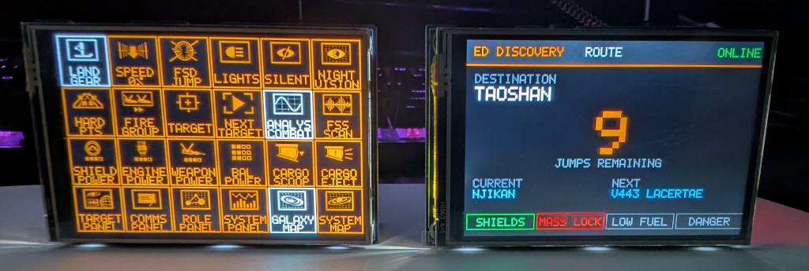
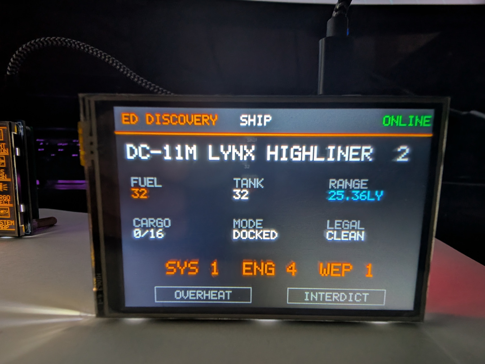
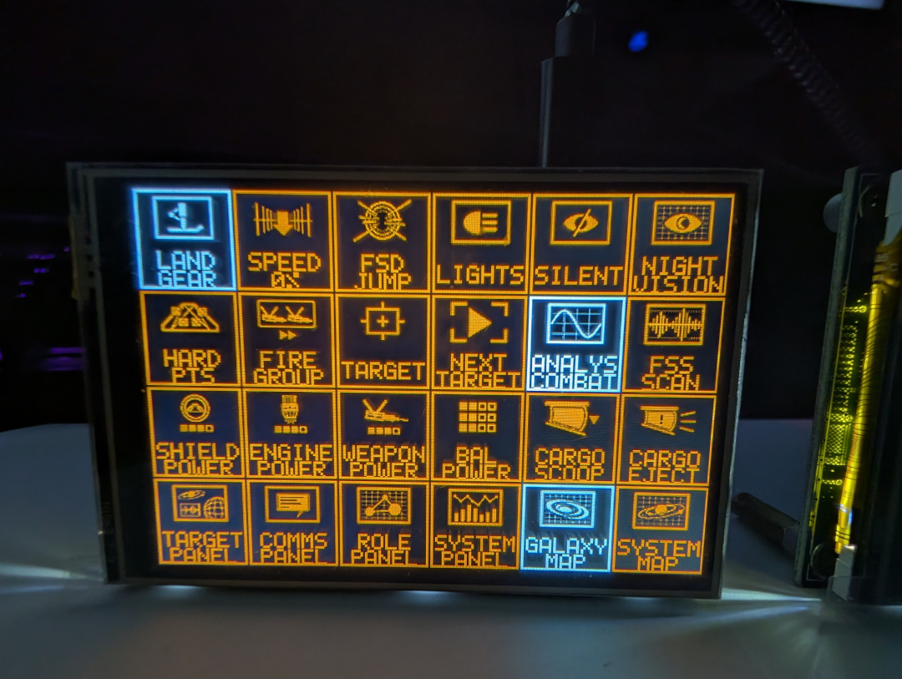

# PicoDeck-EDDiscovery

PicoDeck-EDDiscovery is a two-device Raspberry Pi Pico control and telemetry
system for **Elite Dangerous**. It is derived from the ideas in the original
[EDDPiDeck](https://github.com/d3cker/EDDPiDeck/tree/devel), but both devices run
as native RP2040 firmware and communicate with the gaming PC over USB.

> **EDDiscovery is required.** Both firmware images use the EDDiscovery Web
> Server and its `EDDJSON` WebSocket protocol as their telemetry source. The
> keyboard can still emit raw HID key presses when EDDiscovery is absent, but
> its persistent game-state highlighting will not work. The telemetry display
> has no useful game data without EDDiscovery.





## Repository layout

```text
PicoDeck-EDDiscovery/
|-- common/                  shared USB networking and EDDJSON client
|-- PicoDeck-ED-Display/     telemetry and route display firmware
|-- PicoDeck-ED-Keyboard/    24-button touch keyboard firmware
|-- .github/workflows/       manual Linux release build
|-- tools/                   shared Windows and Linux build tooling
|-- setup-toolchain.cmd      install the build environment once
|-- build-all.cmd            build both firmware images
`-- dist/                    created by build-all.cmd
```

Each application subdirectory is a separate CMake firmware target with its own
README, application source, build script, and UF2 output. Both targets compile
the transport components from `common/`.

**Both firmware builds work with either supported Waveshare LCD model. You can
use the same LCD model for both devices; two different display models are not
required.**

## Shared firmware components

The `common/` directory contains the code that must behave consistently in both
devices:

- `net_usb.c`: TinyUSB NCM-to-lwIP interface and the local DHCP server setup
- `websocket_client.c`: RFC 6455 handshake, framing, fragmentation, ping/pong,
  timeouts, and reconnect backoff
- `eddjson_client.c`: EDDJSON WebSocket subprotocol, initial requests, and
  periodic recovery requests
- `lwipopts.h`: the common no-OS lwIP configuration
- `picodeck_common.cmake`: source, dependency, and per-target buffer integration

Application code supplies the parts that are intentionally different: USB
subnet, DHCP domain, lwIP interface name, WebSocket key and ping payload,
EDDJSON request set, receive-buffer size, and message handler. USB descriptors
remain target-specific because Display exposes NCM only, while Keyboard is a
composite HID plus NCM device.

## What the two devices do

| | PicoDeck-ED-Display | PicoDeck-ED-Keyboard |
|---|---|---|
| |  | |
| Primary purpose | Show route, ship, system, commander, and warning data | Send 24 configurable Elite Dangerous keyboard commands |
| Original hardware | Waveshare Pico-Eval-Board | Waveshare Pico-ResTouch-LCD-3.5 |
| Display | 3.5-inch, 480x320, ILI9488 | 3.5-inch, 480x320, ILI9488 |
| Touch | XPT2046 interrupt; touch anywhere changes page | Full XPT2046 coordinate input for the 6x4 button grid |
| Extra input | Eval Board `KEY1` also changes page | Touch buttons; long-press SYSTEM MAP enters BOOTSEL |
| USB functions | CDC-NCM network adapter | HID keyboard plus CDC-NCM network adapter |
| EDDiscovery data | Status, indicators, generic UI events, and recent journal rows | Indicator state and GUI focus |
| USB subnet | `192.168.7.0/24` | `192.168.8.0/24` |

The firmware images are not interchangeable by function. Flash the **Display**
firmware when you want telemetry pages and flash the **Keyboard** firmware when
you want HID controls, regardless of which compatible Waveshare screen carrier
you physically use.

## Hardware used for development

- Two classic **Raspberry Pi Pico RP2040** boards. Pico W, Pico 2, and Pico 2 W
  were not build or hardware targets.
- One [Waveshare Pico-Eval-Board](https://www.waveshare.com/wiki/Pico-Eval-Board).
  It integrates a 3.5-inch 480x320 ILI9488 resistive-touch display, an XPT2046
  touch controller, `KEY1`, a CP2102 USB-to-UART connector, and other evaluation
  peripherals.
- One [Waveshare Pico-ResTouch-LCD-3.5](https://www.waveshare.com/wiki/Pico-ResTouch-LCD-3.5).
  It is a compact Pico display carrier with a 480x320 ILI9488 panel, XPT2046
  resistive touch, programmable backlight, and microSD slot.
- Two USB data cables, one from each Pico's **native USB connector** to the
  Windows gaming PC.
- A Windows 11 x64 gaming PC running Elite Dangerous and EDDiscovery.

## EDDiscovery setup

1. Install and start [EDDiscovery](https://github.com/EDDiscovery/EDDiscovery).
2. In EDDiscovery, enable its **Web Server**.
3. Set the Web Server port to `6502`.
4. Keep EDDiscovery running while using either Pico.
5. When Windows Firewall prompts for EDDiscovery, allow it on the network
   profile assigned to the Pico USB adapters.
6. If no prompt appears and a Pico cannot connect, create an inbound Windows
   Firewall rule allowing `EDDiscovery.exe` to accept TCP port `6502`.

The tested EDDiscovery executable reported product version
`19.1.8.0+Release_18.1.5_Real-401-gcf55b4e54`. The protocol fields used by the
firmware are intentionally parsed defensively, but other EDDiscovery versions
may expose different fields or event timing.

## How the USB network works

There is no Ethernet PHY, Ethernet cable, Wi-Fi radio, router, Internet service,
or serial telemetry bridge in either device. TinyUSB makes each Pico appear to
Windows as a **CDC-NCM USB network adapter**. lwIP runs a small IPv4 and TCP
stack directly on the RP2040.

Each Pico is the DHCP server for its own point-to-point USB link:

| Device | Pico/lwIP address | Windows address | Mask | Gateway | DNS |
|---|---:|---:|---:|---:|---:|
| Display | `192.168.7.1` | `192.168.7.2` | `/24` | none | none |
| Keyboard | `192.168.8.1` | `192.168.8.2` | `/24` | none | none |

The two different subnets are deliberate. If both adapters used identical
addresses, Windows would have duplicate connected routes and could send replies
through the wrong USB interface. The absence of a gateway and DNS server is
also deliberate: Windows must continue using the normal LAN/Wi-Fi adapter for
Internet access.

The data flow is:

```text
Elite Dangerous journal/status
            |
            v
EDDiscovery Web Server on Windows, TCP 6502
            ^
            | EDDJSON WebSocket over IPv4
            |
Windows WINNCM USB adapter <==== native Pico USB cable ====> TinyUSB + lwIP
```

The Pico initiates the TCP connection to the Windows-side address. Nothing is
forwarded to the Internet and Windows Internet Connection Sharing must not be
enabled on either Pico adapter.

The keyboard is a composite USB device: the HID keyboard interface and network
interface share the same cable and USB device. Windows sees the two functions
separately. The Display exposes only its network function.

## First-time installation

Build the firmware as described below or obtain the two UF2 files from a
release. Flash the correct UF2 to each Pico:

1. Disconnect the Pico's native USB cable.
2. Hold the Pico's **BOOTSEL** button.
3. Reconnect the native USB cable while holding BOOTSEL.
4. Release BOOTSEL when the `RPI-RP2` drive appears.
5. Copy the appropriate UF2 file onto `RPI-RP2`.
6. The drive disappears and the Pico reboots automatically.
7. Wait for Windows to install the WINNCM adapter. The keyboard also installs a
   standard HID keyboard interface.
8. Confirm that Windows receives `192.168.7.2` for Display or `192.168.8.2` for
   Keyboard. Leave gateway and DNS blank.

Always use the Pico's native USB port for network operation. On the Eval Board,
the second micro-USB connector is attached to a CP2102 UART bridge; it may power
the board but cannot carry the CDC-NCM interface.

## Reproducible Windows build

The repository includes a portable toolchain installer. No global CMake, Ninja,
Python, ARM compiler, Pico SDK, TinyUSB, or lwIP installation is required.

### Host requirements

- 64-bit Windows 10 or Windows 11
- PowerShell 5.1 or newer
- `curl.exe` and `tar.exe` available in `PATH` (included with current Windows)
- Internet access for the first setup
- approximately 1 GB of free disk space for downloads, extracted tools, and
  build trees

### Install the shared toolchain

Open the repository root in File Explorer and double-click:

```text
setup-toolchain.cmd
```

Or from PowerShell:

```powershell
cd C:\path\to\PicoDeck-EDDiscovery
powershell.exe -NoProfile -ExecutionPolicy Bypass -File .\tools\setup-toolchain.ps1
```

The installer downloads pinned archives, verifies their SHA-256 hashes, and
extracts them into ignored `.downloads` and `.toolchain` directories.

| Component | Pinned version/revision |
|---|---|
| Raspberry Pi Pico SDK | 2.2.0 |
| TinyUSB | commit `86ad6e56c1700e85f1c5678607a762cfe3aa2f47` |
| lwIP | commit `77dcd25a72509eb83f72b033d219b1d40cd8eb95` |
| Arm GNU Toolchain | 14.3.Rel1 / GCC 14.3.1 |
| CMake | 3.28.6 |
| Ninja | 1.12.1 |
| Raspberry Pi SDK tools | 2.2.0-3 |
| picotool | 2.2.0-a4 |
| Embedded Python | 3.12.10 x64 |

The setup is idempotent. Running it again reuses valid downloads and installed
components.

### Build both firmware images

Double-click `build-all.cmd`, or run:

```powershell
cd C:\path\to\PicoDeck-EDDiscovery
powershell.exe -NoProfile -ExecutionPolicy Bypass -File .\tools\build-all.ps1 -Configuration Release
```

Outputs:

```text
dist\PicoDeck-ED-Display.uf2
dist\PicoDeck-ED-Keyboard.uf2
dist\LICENSE
dist\THIRD_PARTY_NOTICES.md
dist\ICON_UPSTREAM_LICENSE.md
```

The license and notice files are copied beside the firmware so the `dist`
directory can be published as a complete release bundle.

Use `-Configuration Debug` for an unoptimized debug build. Each subproject can
also be built separately with its own `build.cmd`.

Each build wrapper records the shared-toolchain location used by its build
tree. If the repository or `.toolchain` directory is moved, the wrapper detects
the mismatch and rebuilds that target from a clean CMake cache automatically.
Repeated builds with the same toolchain remain incremental.

## GitHub release workflow

The repository contains a manual GitHub Actions workflow named **Build and
release UF2**. It builds both applications on a standard `ubuntu-24.04` GitHub
hosted runner and publishes a GitHub Release only after the complete build and
validation succeeds.

The workflow is manual by design. Ordinary pushes and pull requests do not
consume runner time and cannot accidentally publish firmware. A release is an
explicit maintainer decision with two inputs:

- `tag`: a new [SemVer](https://semver.org/) tag such as `v0.1.0` or
  `v0.2.0-beta.1`
- `prerelease`: marks the GitHub Release as a prerelease; a tag containing a
  suffix such as `-beta.1` is treated as a prerelease automatically

### Publish a release

The workflow file must first exist on the repository's default branch. Then:

1. Open the repository on GitHub and select **Actions**.
2. Select **Build and release UF2** in the workflow list.
3. Select **Run workflow**.
4. Choose the branch whose exact commit should be released. Use the stable
   default branch for a normal release. Choose `devel` only when deliberately
   publishing a test/prerelease build.
5. Enter a previously unused tag, for example `v0.1.0`.
6. Enable **Mark this as a prerelease** when appropriate.
7. Select the green **Run workflow** button and wait for the job to finish.

The tag is created at the selected branch's checked-out commit only after both
firmware builds succeed. The workflow rejects malformed or existing tags and
will not replace an existing release. It uses the repository's temporary
`GITHUB_TOKEN`; no personal access token or custom repository secret is
required. Repository policy must allow GitHub Actions to write repository
contents so it can create the tag and release.

Each release contains:

```text
PicoDeck-ED-Display.uf2
PicoDeck-ED-Keyboard.uf2
SHA256SUMS.txt
LICENSE
THIRD_PARTY_NOTICES.md
ICON_UPSTREAM_LICENSE.md
```

The release page includes installation and hardware requirements, USB subnet
details, checksums, and automatically generated change notes. The same complete
`dist/` directory is retained as a workflow artifact for 14 days, even before
the release publishing step is inspected.

Standard GitHub-hosted runners are free and unlimited for public repositories.
Private repositories consume the monthly Actions allowance included with the
account and may incur charges after that allowance, depending on the account's
spending configuration. See [GitHub Actions
billing](https://docs.github.com/en/billing/concepts/product-billing/github-actions)
for the current terms.

### Reproduce the Linux build locally

On an x86-64 Linux host with `bash`, `curl`, `tar`, `unzip`, `sha256sum`, Git,
CMake, Ninja, and Python 3 installed:

```bash
bash ./tools/setup-toolchain-linux.sh
bash ./tools/build-all-linux.sh Release
```

The first command downloads the same pinned Pico SDK, TinyUSB, lwIP, and Arm
GNU Toolchain revisions used by the workflow, verifies their SHA-256 hashes,
and installs them under ignored `.toolchain-linux/` and `.downloads-linux/`
directories. The second command builds both applications and creates `dist/`.
Internet access is required for the first setup and for the Pico SDK's pinned
picotool checkout.

## Development environment used

The release build was developed and verified on:

- Windows 11 Pro 25H2 x64, build `26200.8655`
- Windows PowerShell `5.1.26100.8655`
- classic Raspberry Pi Pico / RP2040 targets
- Pico SDK 2.2.0
- Arm GNU Toolchain 14.3.Rel1 (`arm-none-eabi-gcc` 14.3.1)
- CMake 3.28.6 and Ninja 1.12.1
- Python 3.12.10 embedded x64
- picotool 2.2.0-a4
- EDDiscovery on the same Windows PC as Elite Dangerous

The build does not require Visual Studio, VS Code, Arduino IDE, or Thonny.

## Using the other screen carrier

Both tested Waveshare products use a 480x320 ILI9488 display over SPI and an
XPT2046 resistive-touch controller. The project configurations also use the
same essential GPIO map:

| Signal | Pico GPIO |
|---|---:|
| LCD DC | GP8 |
| LCD CS | GP9 |
| LCD SCK | GP10 |
| LCD MOSI | GP11 |
| LCD MISO | GP12 |
| Backlight | GP13 |
| LCD reset | GP15 |
| Touch CS | GP16 |
| Touch IRQ | GP17 |
| SD CS / D3 | GP22 |

This makes a carrier swap practical, but not conceptually automatic: choose the
firmware by the function you want, then validate orientation and touch behavior
on the actual hardware revision.

### Run PicoDeck-ED-Display on Pico-ResTouch-LCD-3.5

1. Assemble the Pico and ResTouch module in the orientation shown by Waveshare;
   the Pico USB connector and microSD slot must face the same direction.
2. Flash `PicoDeck-ED-Display.uf2`, not the Keyboard UF2.
3. Connect the Pico's native USB port to Windows.
4. The standalone ResTouch carrier has no Eval Board `KEY1`, but the Display
   firmware also advances pages when the screen is touched, so all required UI
   navigation remains available.
5. Verify display rotation. If it is inverted on another board revision, adjust
   the ILI9488 memory-access/orientation command in
   `PicoDeck-ED-Display/src/lcd.c` and rebuild.
6. Display page switching uses only the XPT2046 touch interrupt, not coordinates,
   so coordinate calibration is not required for this use case.

### Run PicoDeck-ED-Keyboard on Pico-Eval-Board

1. Install the Pico in the Eval Board and use the Pico's native USB connector.
2. Flash `PicoDeck-ED-Keyboard.uf2`, not the Display UF2.
3. Verify all 24 touch tiles, especially the four corners.
4. The Keyboard needs actual X/Y coordinates. If touches are offset, mirrored,
   or assigned to adjacent tiles, recalibrate the Q16.16 coefficients in
   `PicoDeck-ED-Keyboard/src/board.h` and review the axis inversion in
   `PicoDeck-ED-Keyboard/src/touch.c`.
5. If the image orientation differs, adjust the ILI9488 orientation in
   `PicoDeck-ED-Keyboard/src/lcd.c` and make the corresponding touch-axis change.
6. The Eval Board's physical `KEY1` is not assigned by the Keyboard firmware;
   all keyboard interaction remains touchscreen-based.

### Checklist for an untested ILI9488/XPT2046 carrier

Before assuming compatibility, verify resolution, controller models, voltage,
GPIO mapping, SPI mode, display orientation, backlight polarity/PWM, touch axis
order, touch calibration, and access to the Pico's native USB connector. Change
the target project's `src/board.h`, `src/lcd.c`, and (for coordinate touch)
`src/touch.c`, then rebuild that project. Do not solve a hardware swap by
flashing the firmware for the wrong application.

## Troubleshooting both USB adapters

- If only one Pico works, check `Get-NetIPAddress` in PowerShell. The host
  addresses must be different: `.7.2` and `.8.2`.
- If an adapter says *Unidentified network*, that is normal. It is a private
  point-to-point link with no gateway.
- If Internet access breaks, remove any manually entered gateway/DNS and disable
  Internet Connection Sharing on both Pico adapters.
- If a Pico never reaches EDDiscovery, verify TCP port `6502`, Windows Firewall,
  and that EDDiscovery is running before rebooting the Pico.
- If Windows cached an older USB layout, remove the old PicoDeck device from
  Device Manager, disconnect the Pico, and reconnect it.

## Licenses and third-party material

Original PicoDeck-EDDiscovery source code and documentation are licensed under
the repository-level [MIT License](LICENSE). Third-party material is excluded
from that grant and keeps its original license.

In particular, the generated Keyboard icon masks and the copies embedded in the
Keyboard UF2 are derived from artwork by Keath Milligan and remain licensed
under CC BY-SA 3.0. See [THIRD_PARTY_NOTICES.md](THIRD_PARTY_NOTICES.md) for
attribution, modifications, source revision, license links, and notices for the
other components used by the firmware.
